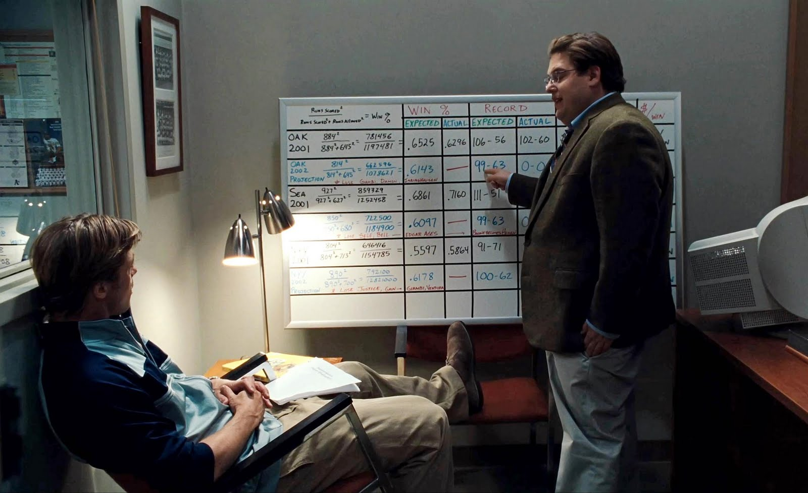

# Introducation
***

This project was completed as part of the Udemy Data Science and Machine Learning Bootcamp course. It has been updated to reflect methodologies learned as part of the CodeClan Data Analysis Course.  

  

## Moneyball
***  

### Background
Source: [Wikipedia](https://en.wikipedia.org/wiki/2002_Oakland_Athletics_season)

The 2002 Oakland A's
The Oakland Athletics' 2002 season was the team's 35th in Oakland, California. It was also the 102nd season in franchise history. The Athletics finished first in the American League West with a record of 103-59.

The Athletics' 2002 campaign is one the most famous in franchise history. Following the 2001 season, Oakland saw the departure of three key players (the lost boys). Billy Beane, the team's general manager, responded with a series of under-the-radar free agent signings. The new-look Athletics, lacked  star power, but surprised the baseball world by besting the 2001 team's regular season record. The team is most famous, however, for winning 20 consecutive games between 13 August and 4 September, 2002. The Athletics' season was the subject of Michael Lewis' 2003 book Moneyball: The Art of Winning an Unfair Game. The story was later turned into a movie staring Brad Pitt and Jonah Hill.



The central theme of Michael Lewis book was that the practices in 2002 were flawed. A lot of statistics that had been collected since the 19th century and were used as a gauge of the player. Most of these stats centered on the number of runs that could be attributed to a player. Instead The Oaklands focused on more analytical metrics such as on-base percentage and slugging.

By re-evaluating the strategies that produce wins on the field, the 2002 Athletics, with approximately US 44 million dollars in salary, were competitive with larger market teams such as the New York Yankees, who spent over US$125 million in payroll that same season.


## The Project 


### Aims 

The aim of this project is to find replacement players for the ones lost at the start of the off-season - During the 2001–02 offseason, the team lost three key free agents to larger market teams: 2000 AL MVP Jason Giambi to the New York Yankees, outfielder Johnny Damon to the Boston Red Sox, and closer Jason Isringhausen to the St. Louis Cardinals.

The replacement players must fulfill the following criteria:

 * The total combined salary of the three players can not exceed 15 million dollars.
 * Their combined number of At Bats (AB) needs to be equal to or greater than the lost players.
 * Their mean On Base Percentage (OBP) had to be equal to or greater than the mean OBP of the lost players  


## Packages   

```{r echo=TRUE, message=FALSE, warning=FALSE}
library(tidyverse)
library(janitor)
```


## Data
Data is from Sean Lahaman's [Website](http://www.seanlahman.com/baseball-archive/statistics/)  a  source for baseball statistics.

```{r message=FALSE, warning=FALSE}
batting <- read_csv("data/batting.csv") %>% 
  clean_names()

salaries <- read_csv("data/salaries.csv") %>% 
  clean_names()
```


# Data Exploration and Cleaning


```{r}
summary(batting)
```
 
These are the stats that we have available from the dataset. Looking at the dataset some feature engineering needs to be carried out to get the number of singles,
batting average, on base percentage and slugging percentage.

## Feature Engineering 

### Singles
The number of singles is the number of times a player has safely reached first base. This can be calulated by taking the number of hits (H) and subtracting the number of doubles (2B), triples (3B) and home runs (HR)

$$ 1B = H - 2B - 3B - HR $$

```{r}
batting_singles <- batting %>% 
  mutate(x1b = h - x2b - x3b - hr, .before = x2b)
```

### Batting Average

Batting Average (AVG) is divided by the number of hits (H) by at bat (AB), the time batters turn against a pitcher.

$$ AVG = \frac{H}{AB} $$

```{r}
batting_avg <- batting_singles %>% 
  mutate(avg = h / ab)
```


### On Base Percentage

On Base Percentage can be calcuated in the following way:

$$OBP={\frac  {H+BB+HBP}{AB+BB+HBP+SF}}$$
where

* H = Hits
* BB = Bases on Balls (Walks)
* HBP = Hit By Pitch
* AB = At bat
* SF = Sacrifice fly

# The Lost Boys
*** 

Before replacements can be found, the key
